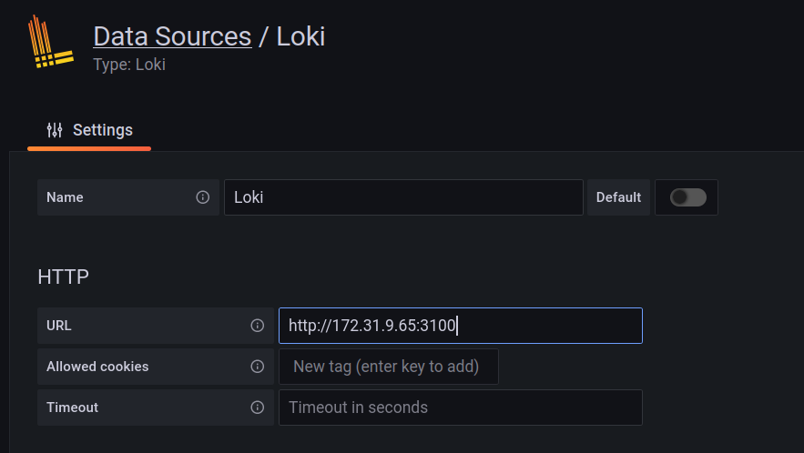
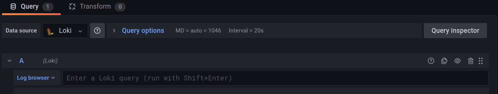
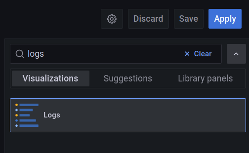

# AWS HPC Cluster Setup

## Prerequisites

* Start an EC2 Instance and establish and ssh an session
* Configure aws cli

  ```bash
  aws configure
  ```

* Upgrade boto3

  ```bash
  pip install boto3 --upgrade
  ```

* Install aws parallel cluster cli

  ```bash
  pip3 install "aws-parallelcluster" --upgrade --user
  ```


## Create s3 bucket

```bash
export BUCKET_POSTFIX=$(uuidgen --random | cut -d'-' -f1)
echo "Your bucket name will be mlbucket-${BUCKET_POSTFIX}"
aws s3 mb s3://mlbucket-${BUCKET_POSTFIX} --region us-west-2
```

Output:

```bash
make_bucket: s3://mlbucket-057bf1b1
```

:warning: Make necessary changes to the post install scripts

## Upload post-install script

```bash
aws s3 cp head-post-install.sh s3://mlbucket-${BUCKET_POSTFIX}
upload: ./post-install.sh to s3://mlbucket-057bf1b1/head-post-install.sh

aws s3 cp compute-post-install.sh s3://mlbucket-${BUCKET_POSTFIX}
upload: ./compute-post-install.sh to s3://mlbucket-057bf1b1/compute-post-install.sh
```

## Create VPC

Please follow the steps below to deploy your new VPC:

1. Click on [this link](https://console.aws.amazon.com/cloudformation/home#/stacks/create/template) to access CloudFormation. Ensure you are in your target region, if not click on the upper left menu to switch to your preferred region.
2. On the Create Stack dialog, in the section *Specify template*, **tick** the box *Upload a template file*. **Click** on *Choose file* then select the file `VPC-Large-Scale.yaml`.
3. You see a list of parameters, do as follows:
  - *Stack Name* is arbitrary, pick `LargeScaleVPC` or any representative name.
  - In *Availability Zones Configuration*, select all the AZs in the region in the *Availability Zones* setting. If using `us-west-1` pick `us-west-1a`, `us-west-1b` and `us-west-1c`.
  - The *Number of Availability Zones* must be equal to the number of AZ you picked in the previous step. If you selected all AZs in `us-west-1` then set the value to `3`.
  - Select an AZ for PublicSubnetAZ
  - Leave the rest as default
5. **Click** on the *Next* orange button at the bottom of the page and do it again until landing on the page *Step 4: Review*.
6. Scroll down to the bottom of the page. **Tick** the acknowledgement box in the *Capabilities* section and create stack.

It will take a few minutes to deploy your VPC architecture. Once deployed, you need to identify the subnet IDs you'll use to place your instances using your AWS ParallelCluster configuration.

1. Go to your VPC dashboard through this [link](https://console.aws.amazon.com/vpc/home).
2. **Click** on *Subnets* then filter the subnets using the availability zone ID you'd like to use. For example, filter with `eu-west-1a` to get subnets only for that Availability Zone.
3. You see a list of subnets, you should see one private subnet deployed using the CloudFormation template. Keep note of the subnet ID (similar to `subnet-abc12345defg`).
4. Clear the filter and filter using the string `Public Subnet`. Keep note of the subnet ID.
5. Modify the AWS ParallelConfiguration as indicated below
```yaml
# in the following section, set the subnet value to the Public Subnet ID
HeadNode:
  Networking:
    SubnetId: subnet-abc123456defg
# in the following section, set the subnet value to the Private Subnet ID
Scheduling:
  SlurmQueues:
      Networking:
        SubnetIds:
          - subnet-xyz123456abcd
```
6. Create your cluster with the new configuration file.

### Create key-pair for hpc cluster

```bash
aws ec2 create-key-pair --key-name hpc-key --query KeyMaterial --region ap-northeast-2 --output text > ~/.ssh/hpc-key
chmod 600 ~/.ssh/hpc-key
```

### Build dcgm from source

Running error injection tests required dcgm debug verion. Below are the steps to build a debug verion of dcgm.

```bash
git clone https://github.com/NVIDIA/DCGM

cd DCGM/dcgmbuild
chmod +x dcgm-build.sh
./dcgm-build.sh

cd ..
./build.sh -d --rpm
```

Upload the built package from `_out` folder to a s3 bucket and update the url in `compute-post-install.sh` script.

### Edit cluster config yaml

#### Modify the cluster.yaml to suit your requirement

#### Refer: [Cluster configuration v3](https://docs.aws.amazon.com/parallelcluster/latest/ug/cluster-configuration-file-v3.html)

Note: Add Subnet with Public IP for headnode and Private IP for compute nodes.

### Create capacity reservation policy for Instance reservation

Optional: Required for using reserved intances

* Create a resource group to group capacity

```bash
aws resource-groups create-group --name EC2CRGroup --configuration '{"Type":"AWS::EC2::CapacityReservationPool"}' '{"Type":"AWS::ResourceGroups::Generic", "Parameters": [{"Name": "allowed-resource-types", "Values": ["AWS::EC2::CapacityReservation"]}]}'
```

* Add capacity reservations to the resource group, every time you create an new ODCR please add it to the Group Reservation. Please ensure to replace `PLACEHOLDER_ACCOUNT_ID` with your account ID, `PLACEHOLDER_CAPACITY_RESERVATION` with the ID of your capacity reservation and `PLACEHOLDER_AWS_REGION` with your AWS region ID (`us-east-1` for example).

```bash
aws resource-groups group-resources --region PLACEHOLDER_AWS_REGION --group EC2CRGroup --resource-arns arn:aws:ec2:PLACEHOLDER_AWS_REGION:PLACEHOLDER_ACCOUNT_ID:capacity-reservation/PLACEHOLDER_CAPACITY_RESERVATION
```

```bash
cat > policy.json << EOF
{
    "Version": "2012-10-17",
    "Statement": [
        {
            "Sid": "RunInstancesInCapacityReservation",
            "Effect": "Allow",
            "Action": "ec2:RunInstances",
            "Resource": [
                "arn:aws:ec2:PLACEHOLDER_AWS_REGION:PLACEHOLDER_ACCOUNT_ID:capacity-reservation/*",
                "arn:aws:resource-groups:PLACEHOLDER_AWS_REGION:PLACEHOLDER_ACCOUNT_ID:group/*"
            ]
        }
    ]
}
EOF
```

* Create the IAM policy on your AWS account using the `json` file you created.

```bash
aws iam create-policy --policy-name RunInstancesInCapacityReservation --policy-document file://policy.json
```

#### Using Custom ami for compute nodes

Refer: <https://docs.aws.amazon.com/parallelcluster/latest/ug/Image-v3.html>

#### [Building custom ami](./custom-ami/Readme.md)

### Create HPC cluster


```bash
# Create hpc cluster
pcluster create-cluster --cluster-name  my-hpc-cluster --cluster-configuration cluster.yaml
```

Output

```json
{
  "cluster": {
    "clusterName": "my-hpc-cluster",
    "cloudformationStackStatus": "CREATE_IN_PROGRESS",
    "cloudformationStackArn": "arn:aws:cloudformation:us-west-2:<ACCOUNT_ID>:stack/my-hpc-cluster/dc43a000-640b-11ec-846b-0a803e033d61",
    "region": "us-west-2",
    "version": "3.1.1",
    "clusterStatus": "CREATE_IN_PROGRESS"
  }
}
```

### Update cluster

#### Stop cluster

```bash
pcluster update-compute-fleet --cluster-name my-hpc-cluster --status STOP_REQUESTED
```

#### Update cluster config

Edit `MaxCount` and `MinCount` of ComputeResources in cluster.yaml as below

```yaml
MaxCount: 4
MinCount: 2
```

```bash
pcluster update-cluster --cluster-name my-hpc-cluster --cluster-configuration cluster.yaml
```

#### Start cluster

```bash
pcluster update-compute-fleet --cluster-name my-hpc-cluster --status START_REQUESTED
```

### Create a IAM user account

Create an IAM user account with programmatic credentials and assign the AWS Managed Policy `AmazonEC2ReadOnlyAccess`, `AmazonS3ReadOnlyAccess`, `CloudWatchLogsReadOnlyAccess`, `CloudWatchReadOnlyAccess`

### Modify the prometheus.yaml

1. Update prom-config-example.yaml with region and accesskey, secretkey from above created user account.
2. Ssh into head node
3. Replace the contents of `/home/ec2-user/aws-parallelcluster-monitoring/prometheus` with updated prom-config-example.yaml

### Restart docker compose

```bash
docker-compose --env-file /etc/parallelcluster/cfnconfig -f ~/aws-parallelcluster-monitoring/docker-compose/docker-compose.master.yml -p monitoring-master restart
```

### Dasboards

Grafana dashboard: <https://ec2>-<ip>.<region>.compute.amazonaws.com/grafana/login
Prometheus dashboard: <https://ec2>-<ip>.<region>.compute.amazonaws.com/prometheus/graph

Note: Add inboud rule for port 80 and 443 to headnode security group for grafana and prometheus access.

### For Standalone DCGM Exported

Import the below dashboard into grafana

<https://grafana.com/grafana/dashboards/12239>

## Add Slum Job Log to Grafana

#### Download loki and promtail

```bash
wget https://github.com/grafana/loki/releases/download/v2.4.2/loki-linux-amd64.zip
wget https://github.com/grafana/loki/releases/download/v2.4.2/promtail-linux-amd64.zip

unzip loki-linux-amd64.zip
unzip promtail-linux-amd64.zip
```

#### Download loki and promtail configs

```bash
wget https://raw.githubusercontent.com/grafana/loki/master/cmd/loki/loki-local-config.yaml
wget https://raw.githubusercontent.com/grafana/loki/main/clients/cmd/promtail/promtail-local-config.yaml
```

#### Start loki

```bash
./loki-linux-amd64 --config.file=loki-local-config.yaml &
```

#### Add the slum job output file path to promtail-local-config.yaml

```bash
  - targets:
      - localhost
    labels:
      job: slurmlogs
      __path__: /lustre/uber-prof/training-job/*.out
```

#### Start promtail

```bash
./promtail-linux-amd64 --config.file=promtail-local-config.yaml &
```

#### Add loki datasource to Grafana



#### Add new dashboard

Add new dashboard with loki data source with logs as visualization panel.





### [EFA Supported Instance Types](https://docs.aws.amazon.com/AWSEC2/latest/UserGuide/efa.html#efa-instance-types)

## Demo Videos

### [](https://youtu.be/KhvCCPjHwCY)

### [](https://youtu.be/RzOkHsmRM3U)

### Tests

Refer [tests](./tests) folder for NCCL and fsx tests.
