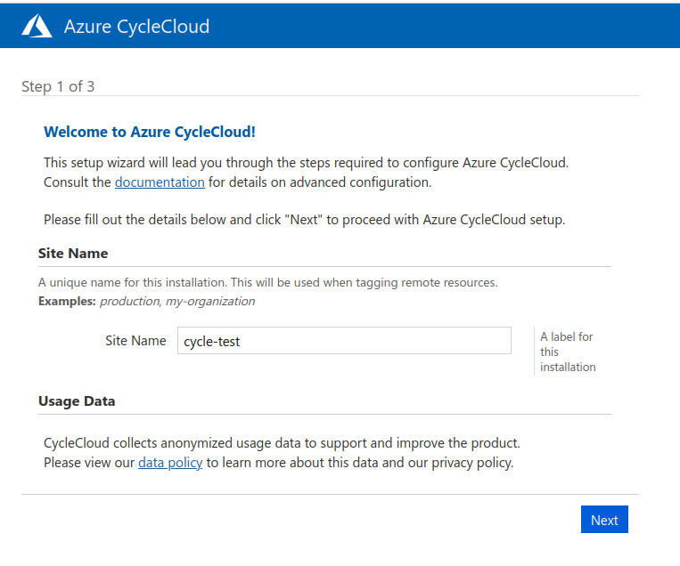
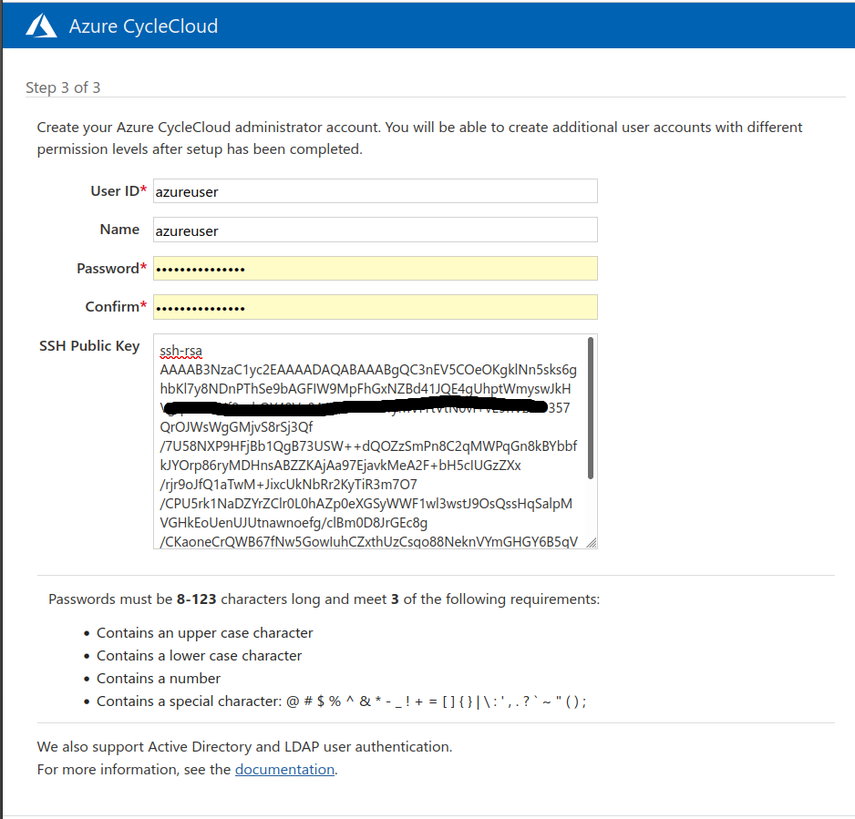
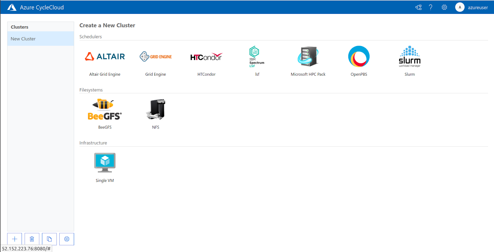

# Slurm cluster creation in Azure using cyclecloud

## Prerequisites

- Create a azure VM instance and install cyclecloud.

Make sure to enable System assigned managed identity for the VM instance.

Refer: <https://docs.microsoft.com/en-us/azure/cyclecloud/how-to/install-manual?view=cyclecloud-8>

Note: Add contributor role to VM instance from Identity tab in VM and allow 8080 port.

## Steps to configure cyclecloud







## Prepare local machine for cycle cloud access

- Install cyclecloud cli.

```bash
wget https://<your CycleCloud domain name>/static/tools/cyclecloud-cli.zip
cd /tmp
unzip /opt/cycle_server/tools/cyclecloud-cli.zip
cd /tmp/cyclecloud-cli-installer
./install.sh
```

- Configure cyclecloud cli

Run `cyclecloud initialize` and enter credentials and cyclecloud domain name.

## Clone uber-prof repo

```bash
git clone https://github.com/chauhang/uber-prof
```

## Create slurm cluster

Navigate to uber-prof/azure

Modify params.json as required and run the below command to create cluster.

Note: Make sure resource group, VN, Subnets are created and available.

```bash
cyclecloud import_cluster <cluster-name> -c Slurm -f template.txt -p params.json
```

## Upload project

Navigate to uber-prof/azure/cluster-init/head and upload the project

```bash
cyclecloud project info
Name: head
Version: 1.0.0
Default Locker: cyclecloud

cyclecloud project upload
```

Similarly upload the compute node project from uber-prof/azure/cluster-init/compute path

```bash
cyclecloud project info
Name: compute
Version: 1.0.0
Default Locker: cyclecloud

cyclecloud project upload
```

## SSH into Head node

```bash
cyclecloud connect scheduler -c <cluster-name>
```

If conda environment is not activated

Run `conda init bash` then exit and login again.

## Install packages

Clone uber-prof repo and run conda update

```bash
git clone https://github.com/chauhang/uber-prof
cd uber-prof/training-job
conda env update -f environment.yml
```

## Training Job

Modify the bert.azure file with bert.azure file for cluster configs

```bash
sbatch bert.azure
```

## Running tests

```bash
sbatch check.slurm
```

## Dashboard

Grafana can be accessed from http://<Headnode-ip>:3000

Import telegraf dashboard and dcgm dasboard to grafana from the json file available in uber-prof/azure folder.

Note: Allow port 3000 on headnode for granfana dashboard

