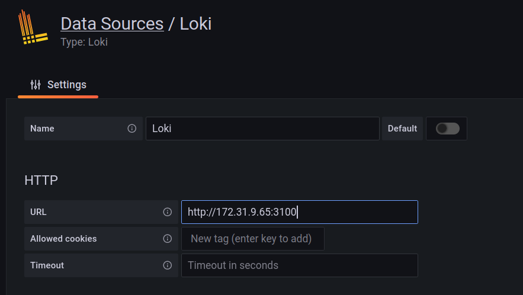
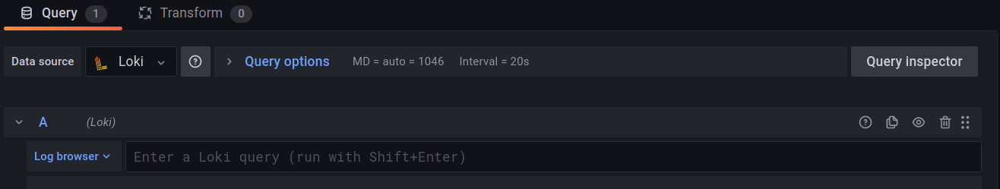
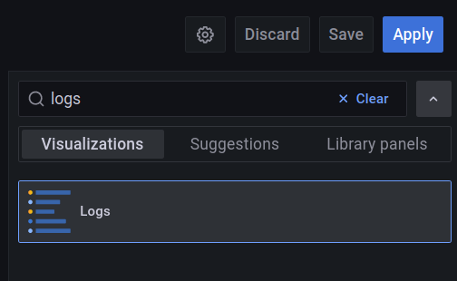

# AWS HPC Cluster Setup

## Prerequisites

* Start an EC2 Instance and establish and ssh an session
* Configure aws cli

  ```bash
  aws configure
  ```

* Install aws parallel cluster cli

  ```bash
  pip3 install "aws-parallelcluster" --upgrade --user
  ```

## Create s3 bucket

```bash
export BUCKET_POSTFIX=$(uuidgen --random | cut -d'-' -f1)
echo "Your bucket name will be mlbucket-${BUCKET_POSTFIX}"
aws s3 mb s3://mlbucket-${BUCKET_POSTFIX} --region us-west-2
```

Output:

```bash
make_bucket: s3://mybucket-057bf1b1
```

## Upload post-install script

```bash
aws s3 cp head-post-install.sh s3://mlbucket-${BUCKET_POSTFIX}
upload: ./post-install.sh to s3://mlbucket-057bf1b1/head-post-install.sh

aws s3 cp compute-post-install.sh s3://mlbucket-${BUCKET_POSTFIX}
upload: ./post-install.sh to s3://mlbucket-057bf1b1/compute-post-install.sh
```

Note: *Add read permission to the scripts in s3. Make sure to change CC version in compute-post-install.sh*


## Create key-pair for hpc cluster

```bash
aws ec2 create-key-pair --key-name hpc-key --query KeyMaterial --output text > ~/.ssh/hpc-key
chmod 600 ~/.ssh/hpc-key
```

## Edit cluster config yaml

### Modify the cluster.yaml to suit your requirement

### Refer: [Cluster configuration v3](https://docs.aws.amazon.com/parallelcluster/latest/ug/cluster-configuration-file-v3.html)

## Create HPC cluster

```bash
# Create hpc cluster
pcluster create-cluster --cluster-name  my-hpc-cluster --cluster-configuration cluster.yaml
```

Output

```json
{
  "cluster": {
    "clusterName": "my-hpc-cluster",
    "cloudformationStackStatus": "CREATE_IN_PROGRESS",
    "cloudformationStackArn": "arn:aws:cloudformation:us-west-2:379740236983:stack/my-hpc-cluster/dc43a000-640b-11ec-846b-0a803e033d61",
    "region": "us-west-2",
    "version": "3.0.2",
    "clusterStatus": "CREATE_IN_PROGRESS"
  }
}
```

## Create a IAM user account

Create an IAM user account with programmatic credentials and assign the AWS Managed Policy `AmazonEC2ReadOnlyAccess`

## Modify the prometheus.yaml

1. Update prom-config-example.yaml with region and accesskey, secretkey from above created user account.
2. Ssh into head node
3. Replace the contents of `/home/ec2-user/aws-parallelcluster-monitoring/prometheus` with updated prom-config-example.yaml

## Restart docker compose

```bash
docker-compose --env-file /etc/parallelcluster/cfnconfig -f ~/aws-parallelcluster-monitoring/docker-compose/docker-compose.master.yml -p monitoring-master restart
```

## For Standalone DCGM Exported

Import the below dashboard into grafana

https://grafana.com/grafana/dashboards/12239

## Add Slum Job Log to Grafana

### Download loki and promtail

```bash
https://github.com/grafana/loki/releases/download/v2.4.2/loki-linux-amd64.zip
https://github.com/grafana/loki/releases/download/v2.4.2/promtail-linux-amd64.zip

unzip loki-linux-amd64.zip
unzip promtail-linux-amd64.zip
```

### Download loki and promtail configs

```bash
wget https://raw.githubusercontent.com/grafana/loki/master/cmd/loki/loki-local-config.yaml
wget https://raw.githubusercontent.com/grafana/loki/main/clients/cmd/promtail/promtail-local-config.yaml
```

### Start loki

```bash
./loki-linux-amd64 --config.file=loki-local-config.yaml &
```

### Add the slum job output file path to promtail-local-config.yaml

```bash
  - targets:
      - localhost
    labels:
      job: slurmlogs
      __path__: /shared/uber-prof/training-job/*.out
```

### Start promtail

```bash
./promtail-linux-amd64 --config.file= promtail-local-config.yaml &
```

### Add loki datasource to Grafana



### Add new dashboard

Add new dashboard with loki data source with logs as visualization panel.





## [EFA Supported Instance Types](https://docs.aws.amazon.com/AWSEC2/latest/UserGuide/efa.html#efa-instance-types)
